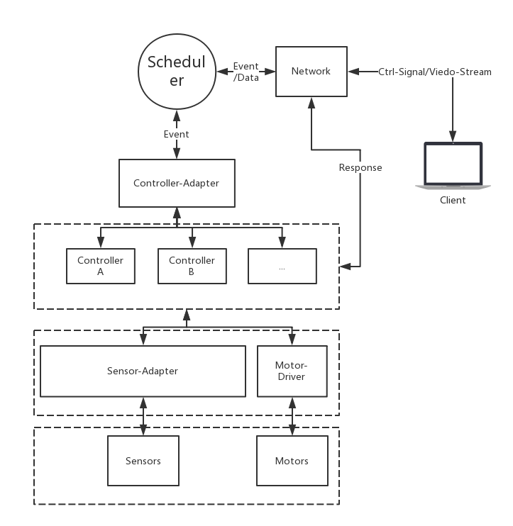

# LightROV-1.0-dev
第一版测试repo

## 假的架构图

## namespace
| namespace       | 用途 |
| :------------   | :----- |
| ltrov           | 根命名空间 |
| ltrov::control  | 电机的控制 |
| ltrov::network  | 潜水器的通信 |
| ltrov::sensor   | 传感器的数据获取及其数据解算 |